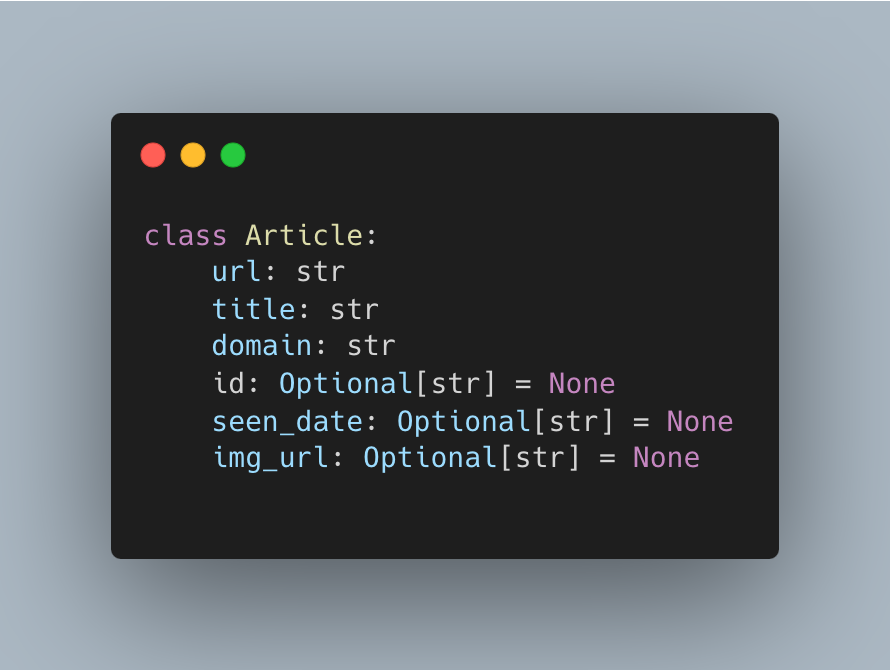
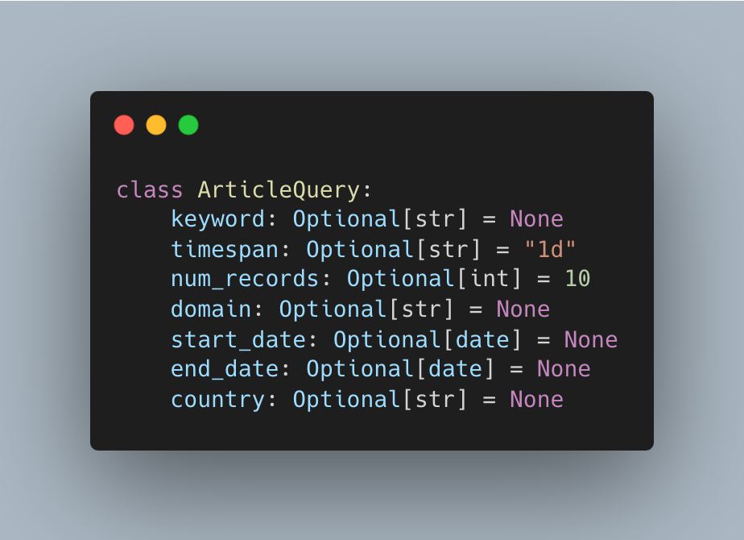
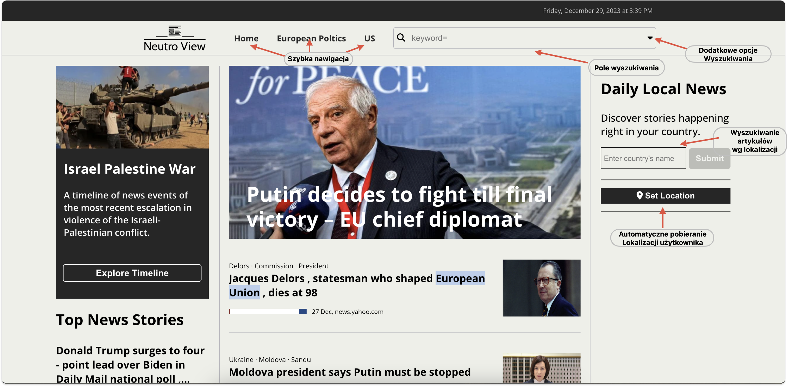
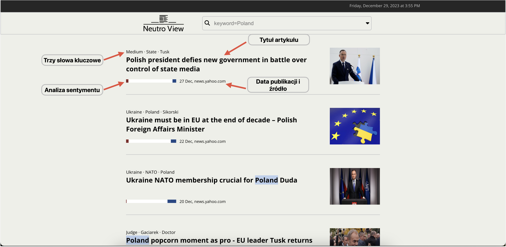

# Webowy agregator newsów (wiadomości)

## 1. Cel projektu:

Stworzenie aplikacji webowej dostarczającej użytkownikowi wiadomości z różnych portali informacyjnych.
Umożliwienie dostosowania wyświetlanych treści na podstawie indywidualnych preferencji użytkownika.

## 2. Funkcje

Aplikacja umożliwia użytkownikowi przeglądanie wiadomości z różnych portali informacyjnych.
Na stronie głównej wyświetlane są najpopularniejsze artykuły prasowe wraz z ich nagłówkami. Użytkownik ma możliwość wyszukiwania
artykułów prasowych na podstawie słów kluczowych oraz zakresu dat publikacji.
Pole wyszukiwania znajduje się w pasku nawigacyjnym, który jest widoczny na każdej stronie aplikacji.

Po wprowadzeniu słów kluczowych oraz zakresu dat publikacji i naciśnięciu przycisku "Search"
wyświetlane są artykuły prasowe spełniające kryteria wyszukiwania. Dla każdego artykułu wyświetlane są informacje takie jak:

- źródło
- data publikacji
- tytuł
- obrazek
- trzy najczęściej występujące słowa kluczowe
- wskaźniki sentymentu w postaci wartości liczbowych dla każdego z trzech typów sentymentu: pozytywnego, neutralnego i negatywnego

Kliknięcie w tytuł artykułu przenosi użytkownika na stronę z artykułem, gdzie wyświetlany jest pełny tekst artykułu.

## 3. Wykorzystane technologie

Niniejszy projekt jest aplikcacją webową typu SPA (Single Page Application) zbudowaną w oparciu o framework React.
Aplikacja korzysta z API dostarczanego przez aplikację napisaną w języku Python z wykorzystaniem frameworka FastAPI.
Część serwerowa aplikacji wykorzystuje bazę danych DynamoDB od Amazon Web Services (AWS) do opcjonalnego zapisu artykułów.

### 3.1. Warstwa serwerowa (Back-end)

Aplikacja serwerowa została napisana w języku Python z wykorzystaniem frameworka FastAPI, który udostępnia API dla aplikacji klienckiej.
API tworzą endpointy (punkty końcowe), które są odpowiedzialne za przetwarzanie żądań typu HTTP GET i zwracanie odpowiedzi w formacie JSON, która
jest przetwarzana przez aplikację kliencką i wyświetlana użytkownikowi.

#### 3.1.1. Pobieranie artykułów prasowych

Model aplikacji tworzą dwie klasy `Article` oraz `ArticleQuery` znajdujące się w katalogu _models_.
Struktura klasy `Article`:

Klasa zawiera pola odpowiadające za przechowywanie informacji o artykule prasowym takie jak:

- **url** - adres URL artykułu
- **title** - tytuł artykułu
- **domain** - domena źródła artykułu
- **seen_date** - data publikacji artykułu
- **id** - unikalny identyfikator artykułu
- **img_url** - adres URL obrazka będącego miniaturką artykułu

Struktura `ArticleQuery`:

Klasa zawiera pola odpowiadające za przechowywanie informacji o zapytaniu użytkownika takie jak:

- **keyword** - słowa kluczowe
- **timespan** - zakres dat publikacji artykułów
- **num_records** - liczba artykułów do pobrania
- **domain** - domena źródła artykułu
- **start_date** - data początkowa zakresu dat publikacji artykułów
- **end_date** - data końcowa zakresu dat publikacji artykułów
- **country** - kraj źródła artykułu

Mechanizm pobierania artykułów prasowych został zaimplementowany w klasie `ArticleService` znajdującej się w katalogu _service_.
Główną rolę w procesie pełni biblioteka gdeltdoc, która umożliwia pobieranie artykułów prasowych wykorzystując API dostarczane
przez serwis GDELT.
Pierwszym krokiem jest utworzenie obiektu klasy `Filter` z biblioteki gdeltdoc w metodzie `get_filters`,
który zawiera informacje o zapytaniu użytkownika. Następnie w metodzie `get_articles_gdelt` tworzony jest obiekt klasy `GdeltDoc`
na podstawie którego wywoływana jest metoda `article_search` wraz z obiektem klasy `Filter` jako parametr.
Metoda `article_search` zwraca listę obiektów zawierających informacje o artykułach prasowych.
Ostatnim krokiem jest przetworzenie listy obiektów na listę obiektów klasy `Article` i zwrócenie jej jako wynik metody `get_articles`.
Wyzej opisany serwis jest dalej wykorzystywany w pliku articles w katalogu _api_, gdzie poprzez framework FastAPI tworzony jest endpoint odpowiedzialny za przetworzenie zadania typu HTTP GET na ścieżce _/articles_. Endpoint przyjmuje parametry zapytania w parametrów adresu URL, które są przekazywane do metody `get_articles`. Finalnie w przypadku powodzenia zwracana jest lista obiektów klasy `Article` w formacie JSON. W przypadku wystąpienia błędu zwracany jest kod błędu HTTP 404 wraz z komunikatem o błędzie.

#### 3.1.2. Analiza sentymentu

Analiza sentymentu jest dziedziną, która zajmuje się automatycznym rozpoznawaniem, klasyfikacją i oceną emocji,
opinii i nastrojów wyrażanych w tekście. Obejmuje ona badanie zarówno pozytywnych, jak i negatywnych aspektów wypowiedzi,
co umożliwia zrozumienie ogólnego sentymentu wyrażonego przez autora. Analiza sentymentu wykorzystuje techniki
przetwarzania języka naturalnego oraz uczenia maszynowego w celu efektywnego analizowania dużych zbiorów danych tekstowych.

Cel analizy sentymentu polega na ekstrakcji i klasyfikacji emocji oraz opinii wyrażanych w tekście.
Istotne jest zrozumienie, czy wypowiedź jest pozytywna, negatywna czy neutralna, a także jakie są główne tematy poruszone
przez autora. Dzięki temu można ocenić ogólny sentyment wypowiedzi oraz zidentyfikować trendy i wzorce w opinii publicznej.
[https://mfiles.pl/pl/index.php/Analiza_sentymentu]

Aplikacja dokonuje analizy sentymentu artykułów prasowych, wykorzystując metody skryptu text*analysis.py, który znajduje się w
katalogu \_api*.
Pierwszym krokiem jest pobranie artykułu prasowego, na podstawie adresu URL artykułu w metodzie `scrap_article`.
Metoda ta wykorzystuje bibliotekę newspaper3k, która pobiera, a następnie przetwarza artykuł prasowy.
Dalej tekst poddawany jest tokenizacji. Tokenizacja jest techniką przetwarzania wstępnego w przetwarzaniu języka naturalnego.
Rozbija ona nieustrukturyzowane dane tekstowe na mniejsze jednostki zwane tokenami. Pojedynczy token może zawierać od pojedynczego
znaku lub pojedynczego słowa do znacznie większych jednostek tekstowych. [https://developer.ibm.com/tutorials/awb-tokenizing-text-in-python/]
Tokenizacja odbywa się w metodzie `tokenize_text`, która wykorzystuje bibliotekę nltk służącą do przetwarzania języka naturalnego.
Następnie z obrobionego tekstu usuwane są znaki interpunkcyjne oraz "stopwords", czyli słowa, które nie niosą ze sobą znaczenia,
a pełnią jedynie funkcję gramatyczną. Znaki interpunkcyjne usuwane są w metodzie `remove_punctuation`, a stopwords w metodzie
`remove_stopwords`.
Następnie tekst poddawany jest lematyzacji, czyli sprowadzeniu słów do ich podstawowej formy.
Lematyzacja to proces grupowania różnych form fleksyjnych słowa, dzięki czemu można je analizować jako pojedynczy element.
Lematyzacja jest podobna do stemmingu, ale dodaje kontekst do słów. Łączy więc słowa o podobnym znaczeniu w jedno słowo.
Lematyzacja odbywa się w metodzie `lemmatize_text`. Ostatnim krokiem jest usunienięcie wyrazów niebędących rzeczownikami, które
wykonywane jest w metodzie `remove_non_nouns`.
Wynikiem procesu jest struktura typu `dict`, która zawiera wskaźniki sentymentu w postaci wartości liczbowych dla każdego z trzech
typów sentymentu: pozytywnego, neutralnego i negatywnego. Oprócz tego struktura zawiera listę trzech najczęściej występujących słów.

### 3.2. Warstwa klienta (Front-end)

Warstwa klienta została napisana w języku TypeScript X z wykorzystaniem frameworka React.
Tworzoją ją komponenty, które są odpowiedzialne za wyświetlanie danych użytkownikowi oraz za interakcję z użytkownikiem.
Komponenty znajdują się w katalogu _components_ i składają się ze stylów - pliki z rozszerzeniem ".scss",
jak równie z plików z rozszerzeniem ".tsx", które zawierają logikę komponentu.
W podkatalogu _home_ znajdują się komponenty odpowiedzialne za wyświetlanie strony głównej aplikacji, a są to

- **headlines** - komponent wyświetlający nagłówki artykułów prasowych w centralnej części strony głównej
- **local-news** - komponent ustalający słowo kluczowe na podstawie pobranej lokalizacji użytkownika
- **top-stories** - komponent wyświetlający najpopularniejsze artykuły prasowe w lewej dolnej części strony głównej

W folderze _navbar_ znajdują się pliki komponentu odpowiedzialny za wyświetlanie paska nawigacyjnego, który jest widoczny na każdej stronie aplikacji w górnej części ekranu.
Folder _search_ zawiera komponenty odpowiedzialne za wyświetlanie wyników wyszukiwania artykułów prasowych na podstawie parametrów wprowadzonych przez użytkownika.``

W warstie klienta istotną rolę pełnią serwisy, które są odpowiedzialne za komunikację z API warstwy serwerowej aplikacji.
Znajdują się one w katalogu _services_ i są to:

- **ArticleService** - serwis odpowiedzialny za pobieranie artykułów prasowych w formacie JSON z API warstwy serwerowej
- **TextAnalysisService** - serwis odpowiedzialny za analizę sentymentu artykułów prasowych na podstawie adresu URL artykułu
- **LocationService** - serwis odpowiedzialny za pobieranie lokalizacji użytkownika na podstawie adresu IP

## 4. Prezentacja aplikacji

### 4.1 Strona główna

### 4.2 Wyszukiwanie artykułów prasowych
